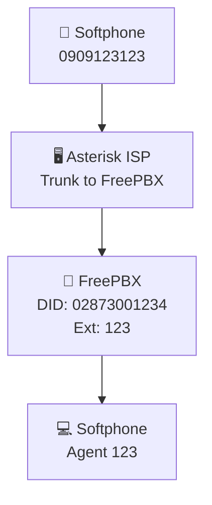

# 📌 Project: Asterisk ISP Gateway Simulation

## 1. Description
This project simulates a **Telco/ISP environment** using **Asterisk**:

- 📱 Provide a simulated mobile extension: **0909123123**  
- ☎️ Provide a fixed-line DID number: **02873001234**  
- 🔗 Connect to **FreePBX** via **IP Trunk (PJSIP)** without SIP accounts  
- 🔄 Support **two-way call routing**:
  - `Mobile 0909123123 → DID 02873001234 → FreePBX → Agent 123`
  - `Agent 123 (FreePBX) → Mobile 0909123123 → Softphone`

👉 Goal: Emulate a **real carrier call flow** and validate **inbound/outbound** communication between FreePBX and Asterisk.

---

## 2. Architecture


## Components
### 🖥️ Asterisk (ISP/Carrier)
- Manages extension 0909123123 (registered via softphone) 
- Provides an IP-based trunk (PJSIP) to FreePBX Dialplan routing:
- Inbound: DID 02873001234 → FreePBX
- Outbound: Number 0909123123 → extension inside Asterisk

### 📡 FreePBX
- Configured with IP Trunk to Asterisk 
- Inbound Route: DID 02873001234 → Extension 123 
- Outbound Route: 0909123123 → Asterisk trunk

## Testing Procedure
### 🟢 Inbound Call Test
- Register softphone (Zoiper/X-Lite) to Asterisk as 0909123123 
- Dial 02873001234 Asterisk → FreePBX trunk → inbound route → Extension 123 Softphone 
- (Agent 123) rings → ✅ PASS

### 🔵 Outbound Call Test
- Register softphone to FreePBX as extension 123 
- Dial 0909123123 
- FreePBX outbound route → Asterisk trunk → Extension 0909123123 Softphone 
- 0909123123 rings → ✅ PASS

## SIP Signaling Verification
### On Asterisk CLI:
```bash
asterisk -rvvvvv
pjsip show endpoints # Verify endpoint/trunk registrations
pjsip set logger on # Trace SIP INVITE, 100 Trying, 180 Ringing, 200 OK
